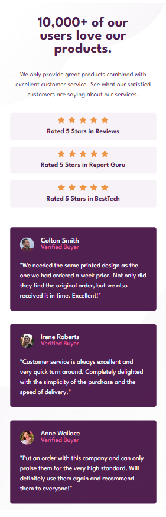
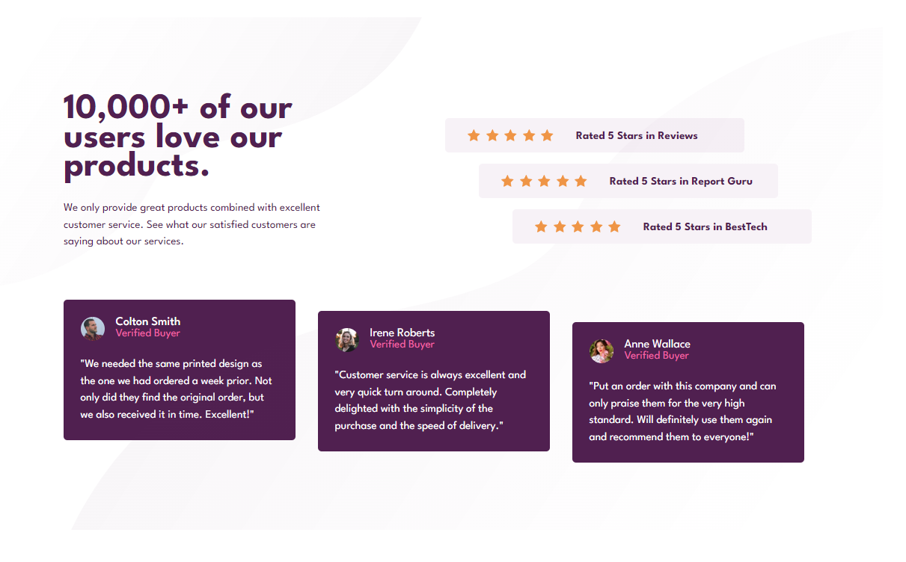

# Frontend Mentor - Social proof section solution

This is a solution to the [Social proof section challenge on Frontend Mentor](https://www.frontendmentor.io/challenges/social-proof-section-6e0qTv_bA). Frontend Mentor challenges help you improve your coding skills by building realistic projects. 

## Table of contents

- [Overview](#overview)
  - [The challenge](#the-challenge)
  - [Screenshot](#screenshot)
  - [Links](#links)
- [My process](#my-process)
  - [Built with](#built-with)
  - [What I learned](#what-i-learned)
  - [Continued development](#continued-development)
- [Author](#author)

## Overview

### The challenge

Users should be able to:

- View the optimal layout for the section depending on their device's screen size

### Screenshot

### Links

- Solution URL: [Add solution URL here](https://www.frontendmentor.io/solutions/css-grid-vEqZScY0ZL)
- Live Site URL: [Add live site URL here](https://pr3t0r.github.io/social-proof-section-master/)

## My process

### Built with

- VSCODE
- CSS custom properties
- without framework
- Mobile-first workflow
- CSS grid
- CSS flexbox
- media queries
- eye sighting (no exact sizes were available except paragraphs)

### What I learned

Grid layouts.

### Continued development

Deeper grid knowledgement.

## Author

- Frontend Mentor - [@Pr3t0r](https://www.frontendmentor.io/profile/Pr3t0r)
